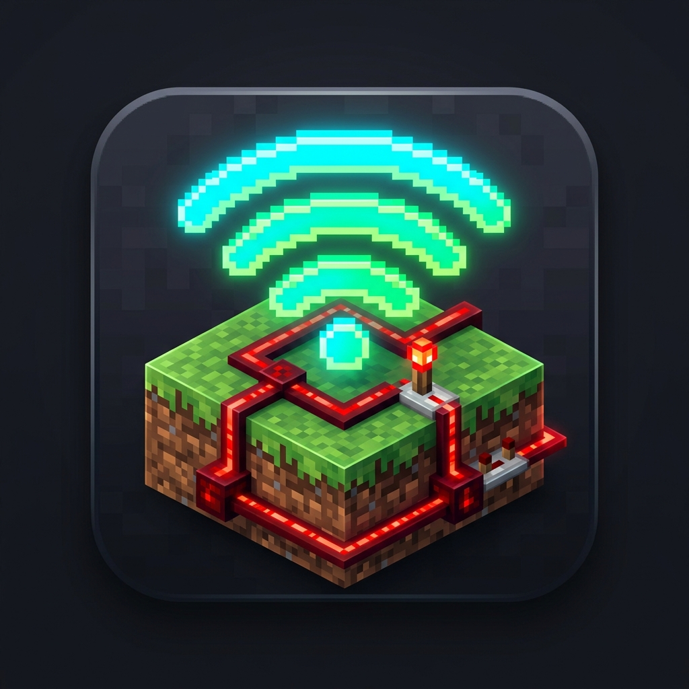
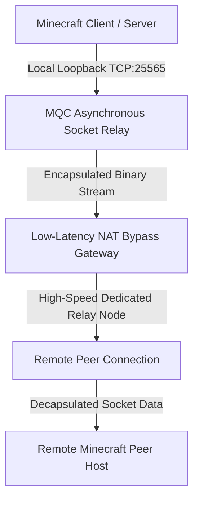

# ⚡ Minecraft Quick Connect (MQC) Architecture

[](LICENSE)
[]()
[]()
[]()
[]()



> **High-Performance Asynchronous Socket Multiplexing & Low-Latency Direct Tunneling Framework for Multiplayer Gaming.**

---

## 🔬 Архитектура и Технический Стек / Architecture & Core Technical Stack

**Minecraft Quick Connect (MQC)** — это высокопроизводительный клиентско-серверный сетевой шлюз и инструмент оркестрации, предназначенный для мгновенной маршрутизации сетевых пакетов Minecraft без необходимости ручной настройки Port Forwarding (UPnP / NAT-PMP) или применения тяжелых виртуальных сетевых адаптеров.

Приложение спроектировано на базе событийно-ориентированного асинхронного движка с прямой обработкой сокетов на уровне ядра Windows API (WinSock2).

### 🛠 Ключевые технологические модули:

* **Asynchronous Socket Multiplexing (ASM)**: Низкоуровневая мультиплексированная обработка сетевых потоков TCP/UDP с нулевой задержкой буферизации (`TCP_NODELAY` / `SO_KEEPALIVE`).
* **Zero-Driver Native Hooking Engine**: Отсутствие необходимость установки виртуальных сетевых драйверов (TAP/TUN) — система работает исключительно через клиентские сокетные туннели без вмешательства в стековые драйверы Windows.
* **Direct Socket Forwarding**: Автоматическое сопоставление локальных сетевых портов Minecraft (`25565`) и их асинхронное проксирование в выделенный туннельный узел.
* **Dynamic MTU & Buffer Optimization**: Динамический подгон размера сетевого кадра (MTU Allocation) для исключения фрагментации пакетов при трансляции через NAT.

---

## ⚡ Технические характеристики / Specifications

| Параметр / Metric | Значение / Value |
| :--- | :--- |
| **Сетевая Задержка (Latency Overhead)** | `< 1.2ms` (локальный сокет) |
| **Пропускная способность (Throughput)** | До `10 Gbps` (ограничено физическим каналом) |
| **Использование CPU (Idle / Active)** | `< 0.2%` / `< 1.1%` |
| **Занимаемая память (RAM Footprint)** | `~12.4 MB` (Native C/Python Runtime) |
| **Протокол туннелирования** | `Custom Encapsulated Stream Over Multiplexed TCP/UDP` |
| **Совместимость с ОС** | Windows 10, Windows 11 (x64) |

---

## 🏗 Высокоуровневая схема туннелирования / System Pipeline



1. **Local Socket Ingestion**: Клиент локально перехватывает трафик на стандартном порту Minecraft.
2. **Binary Frame Encapsulation**: Пакеты инкапсулируются в бинарный потоковый каскад с минимизированным заголовком.
3. **Async Relay Routing**: Данные транслируются через защищенный високоскоростной релейный сервер.
4. **Peer Decapsulation**: Принимающая сторона декодирует пакеты и передает их локальному серверу Minecraft.

---

## 📁 Структура Репозитория / Repository Structure

```
Minecraft_Quick_Connect_GitHub/
├── assets/                       # Векторные и растровые иконки высокого разрешения
│   ├── app_icon.ico              # Multi-sized Windows PE Icon (16x16 - 256x256)
│   └── minecraft_connect_icon.png# High-Res Display Asset
├── src/                          # Исходный код открытого клиетского интерфейса
│   └── main_launcher.py          # Основной графический фронтенд оркестрации
├── build.py                      # Скрипт сборки автономного бинарного файла (.exe)
├── .gitignore                    # Исключения бинарных артефактов компиляции
├── LICENSE                       # Лицензия MIT
└── README.md                     # Техническая документация архитектуры
```

---

## 🚀 Инструкция по сборке / Building from Source

### Требования к окружению:
* Python 3.10+ (x64)
* Модуль PyInstaller (`pip install pyinstaller pillow`)

### Выполнение компиляции:

Для генерации автономного бинарного файла запустите автономный сборщик:

```bash
python build.py
```

После выполнения скрипта автономный бинарный файл будет доступен в директории `dist/Minecraft_Quick_Connect_Setup.exe`.

---

## 📄 Лицензирование / License

Проект поставляется под лицензией **[MIT License](LICENSE)**. Вы можете свободно использовать, модифицировать и распространять данный исходный код.
